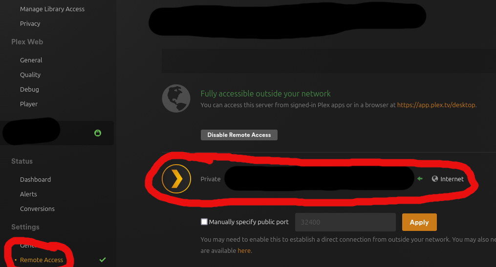
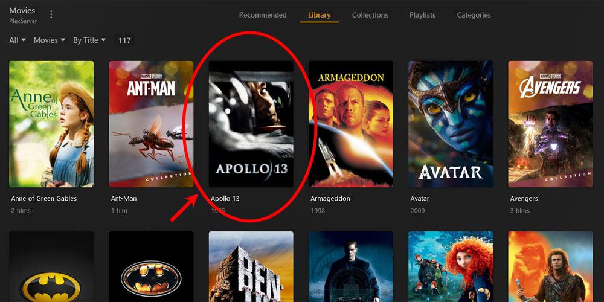
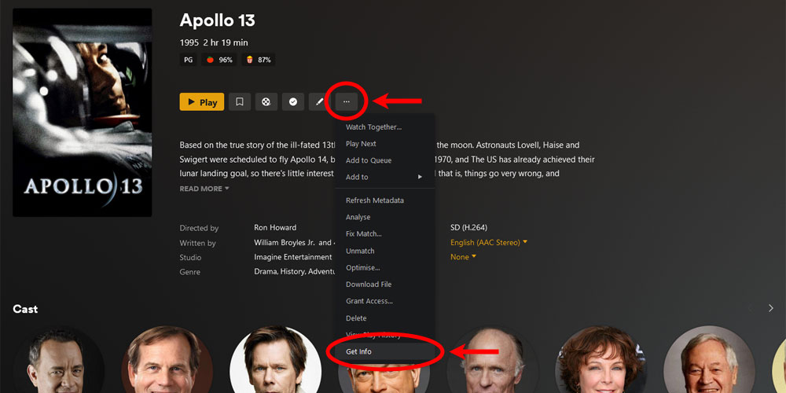
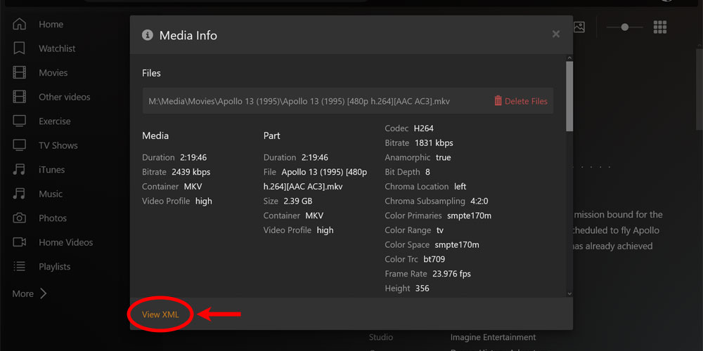
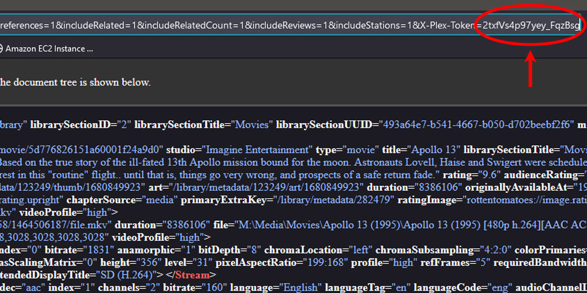

# cinegap
Find missing movie titles from your Plex Library en masse

## Not a Plugin?
Plex Plugins are very powerful (like Radarr and  Bazarr), but installation is not trivial. My simple use case is to find missing titles. I made this so I can get that list with minimal overhead. 

## How it works
You set ENV VARS and run the code locally. Just pass in a pre-formatted csv file to get (a pretty accurate) list of missing titles

## Instructions
1. Get your IP Address from your Plex Server. Local and Remote both work

1. Get your Plex Access Key (Thank you https://www.plexopedia.com/plex-media-server/general/plex-token/)





1. Set ENV VARS
    ```
    export PLEX_IP_ADDRESS=...
    export PLEX_ACCESS_TOKEN=...
    ```
1. Format CSV
    > The csv must be formatted as follows (single item per line):
    ```
    Dr. 
    The Wizard of Oz
    Oh Brother, Where art Thou
    ```
1. Run it
    > You'll need to have Ruby installed on your system and know how to install Gems with Bundler.

    > A test file is included at /test/test.csv (thank you https://www.theyshootpictures.com/gf1000_all1000films.htm)

    ```
    ruby plex_reader.rb <csv_file.csv>
    ```
